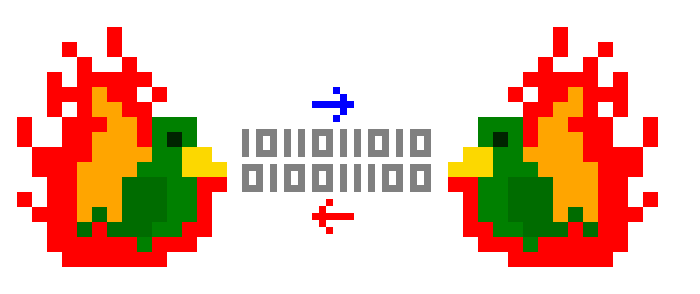

# Phoenix API Server



Backend server to the [Phoenix Distributed Social-Network](https://github.com/pfraze/phoenix). Provides the backend API over a RPC stream, allowing multiple simultaneous frontends and clients.


```javascript
var prpc = require('phoenix-rpc');

// Start the backend and connect a client to it
var server = prpc.server({ datadir: './.phoenix' });
var client = prpc.client();
client.pipe(server).pipe(client);

// Fetch the local user's public key and fingerprint (name)
client.api.getKeys(function(err, keys) {
	if (err) throw err;
	if (keys.exist) {
		console.log(keys.public.toString('hex'));
		console.log(keys.name.toString('hex'));
	}
});

// Create new keys
client.api.createKeys(false, function(err, keys) {
	if (err) throw err;
	console.log(keys.public.toString('hex'));
	console.log(keys.name.toString('hex'));
});

// Manage the network table
client.api.getNodes(function(err, nodes) {
	if (err) throw err;
	console.log(nodes); // [['foo.com', 8080], ['bar.com', 123]]
});
client.api.addNode('baz.com', 1000, function(err) {
	if (err) throw err;
	client.api.delNode('baz.com', 1000, function(err) {
		if (err) throw err;
	});
});

// Wrappers around SSB. NOTE:
// - these return node's streams, not domenic's pull-streams. Use stream-to-pull-stream to convert them
// - unlike ssb, only supports 1 local feed
client.api.getPublicKey(id, cp);
client.api.createFeedStream(opts);
client.api.following();	
client.api.follow(pubkey, cb);
client.api.unfollow(pubkey, cb);
client.api.addMessage(type, message, cb);
client.api.createLogStream(opts);
client.api.createReplicationStream(opts); // :NOTE: does not currently support the 'end' callback
```

### Why the RPC?

 - LevelDB, Phoenix's internal storage engine, is single-threaded. Without the RPC server, only one program could access the db at a time.
 - Phoenix is designed to be accessed by downstream applications, much like Postgres or Redis is. This is how they do it.
